```{r knitr_init, echo=FALSE, cache=FALSE}
library(knitr)
library(rmdformats)

## Global options
options(max.print="75")
opts_chunk$set(echo=TRUE,
	             cache=TRUE,
               prompt=FALSE,
               tidy=TRUE,
               comment=NA,
               message=FALSE,
               warning=FALSE)
opts_knit$set(width=75)
```

```{r creation des variables à utiliser, echo =  FALSE, eval = FALSE}
load(file = "../DATA/RPDetail.RData")

ComputePercentage <- function(df, varquali){
  # calcule les résumés par commune et par modalité
  dfLong <- df %>% 
    group_by_("COMMUNE", varquali) %>%
    summarise(NB = sum(IPONDL))
  
  # transforme en format large
  castFormula <- paste("COMMUNE", " ~ ", varquali, sep = "")
  dfWide <- dcast(dfLong, formula = castFormula, value.var = "NB", drop = FALSE, fill = 0)
  
  # calcule le total ligne
  totalLgmt <- apply(dfWide[, 2:ncol(dfWide)], 1, sum)
  
  # calcule les pourcentages sur le total ligne
  matPct <- apply(dfWide[, 2:ncol(dfWide)], 2, function(x) x / totalLgmt)
  colnames(matPct) <- paste(varquali, sort(unique(df[[varquali]])), sep = "")
  
  # reconstruit le tableau final
  dfFinal <- data.frame(COMMUNE = dfWide$COMMUNE,
                        matPct,
                        stringsAsFactors = FALSE)
  
  return(dfFinal)
}

toulResidPrinc <- toulLog %>% filter(CATL == 1)

# statut d'occupation du logement
tabSTOCD <- ComputePercentage(df = toulResidPrinc, varquali = "STOCD")
# 00 : Logement ordinaire inoccupé
# 10 : Propriétaire
# 21 : Locataire ou sous-locataire d'un logement loué vide non HLM
# 22 : Locataire ou sous-locataire d'un logement loué vide HLM
# 23 : Locataire ou sous-locataire d'un logement loué meublé ou d'une chambre d'hôtel
# 30 : Logé gratuitement
# ZZ : Hors logement ordinaire

# immigration personne de référence
tabIMMIM <- ComputePercentage(df = toulResidPrinc, varquali = "IMMIM")
# 1 : Immigrés
# 2 : Non immigrés
# Y : Hors résidence principale

# activité de la personne de référence
tabTACTM <- ComputePercentage(df = toulResidPrinc, varquali = "TACTM")
# 11 : Actifs ayant un emploi, y compris sous apprentissage ou référence du ménage en stage rémunéré
# 12 : Chômeurs
# 21 : Retraités ou préretraités
# 22 : Elèves, étudiants, stagiaires non rémunérés de 14 ans ou plus
# 23 : Moins de 14 ans
# 24 : Femmes ou hommes au foyer
# 25 : Autres inactifs
# YY : Hors résidence principale
# ZZ : Hors logement ordinaire

# diplome personne de référence
tabDIPLM <- ComputePercentage(df = toulResidPrinc, varquali = "DIPLM")
# 01 : Pas de scolarité
# 02 : Aucun diplôme mais scolarité jusqu'en école primaire ou au collège
# 03 : Aucun diplôme mais scolarité au delà du collège
# 11 : Certificat d'études primaires
# 12 : BEPC, brevet élémentaire, brevet des collèges
# 13 : Certificat d'aptitudes professionnelles, brevet de compagnon
# 14 : Brevet d'études professionnelles
# 15 : Baccalauréat général, brevet supérieur

# type de logement
tabTYPL <- ComputePercentage(df = toulResidPrinc, varquali = "TYPL")
# 1 : Maison
# 2 : Appartement
# 3 : Logement-foyer
# 4 : Chambre d'hôtel
# 5 : Habitation de fortune
# 6 : Pièce indépendante (ayant sa propre entrée)
# Z : Hors logement ordinaire

# Ancienneté de recherche d'emploi (personne de référence du ménage)
tabRECHM <- ComputePercentage(df = toulResidPrinc, varquali = "RECHM")
# 0 : Ne recherche pas d'emploi
# 1 : Cherche un emploi depuis moins d'un an
# 2 : Cherche un emploi depuis plus d'un an
# 9 : Non déclaré (inactif)
# Z : Sans objet (en emploi)
# Y : Hors résidence principale

tabSocial <- tabSTOCD %>%
  select(COMMUNE, STOCD10, STOCD22) %>%
  rename(txPROPRIETAIRES = STOCD10, txHLM = STOCD22) %>%
  left_join(by = "COMMUNE",
    tabIMMIM %>%
      select(COMMUNE,IMMIM1) %>%
      rename( txIMMIGRES = IMMIM1)
  ) %>%
  left_join(by = "COMMUNE",
    tabTACTM %>%
      select(COMMUNE, TACTM12, TACTM21) %>%
      rename(txCHOMEURS = TACTM12, txRETRAITES =  TACTM21)
  ) %>%
  left_join(by = "COMMUNE",
    tabDIPLM %>%
      select(COMMUNE, DIPLM15) %>%
      rename(txDIPLOMESUP = DIPLM15)
  ) %>%
  left_join(by = "COMMUNE",
    tabTYPL %>%
      select(COMMUNE, TYPL1, TYPL2) %>%
      rename(txMAISONS =  TYPL1,txAPPARTEMENTS = TYPL2)
  ) %>%
  left_join(by = "COMMUNE",
    tabRECHM %>%
      select(COMMUNE, RECHM2) %>%
      rename(txCHOMEURSLONGUEDUREE = RECHM2)
  )

save(list = c("toulCom","tabSocial"), file = "ACP.Rdata")
```

```{r chargement donnees exemple, echo = FALSE}
load("Multivarie.Rdata")
```

# Introduction


---

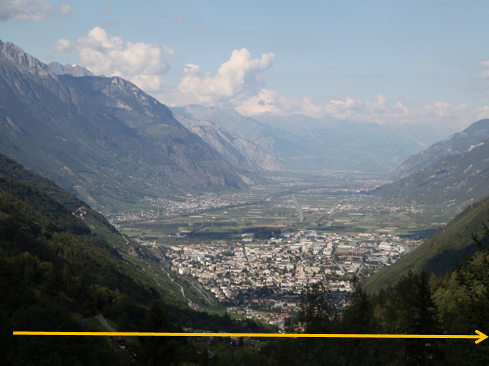

---

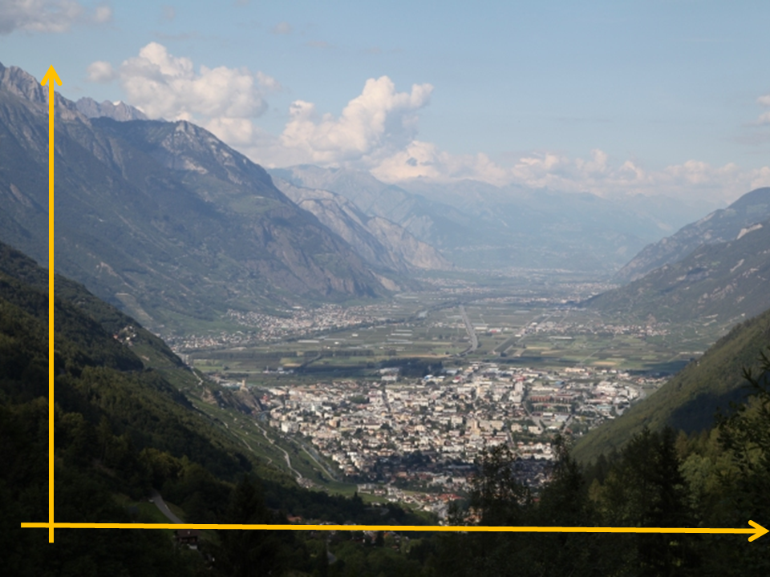

---

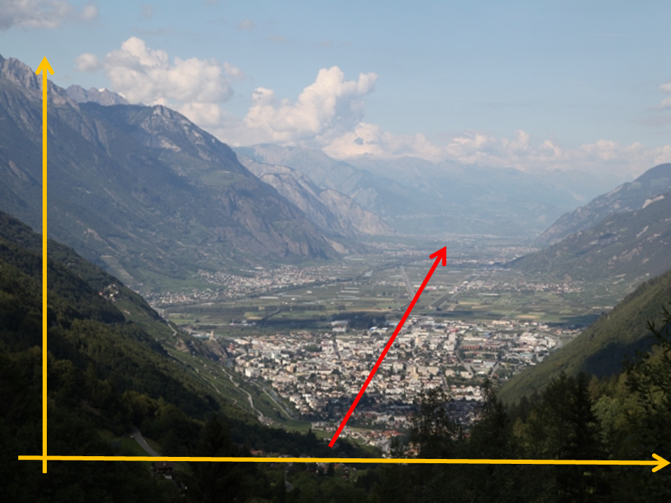

---

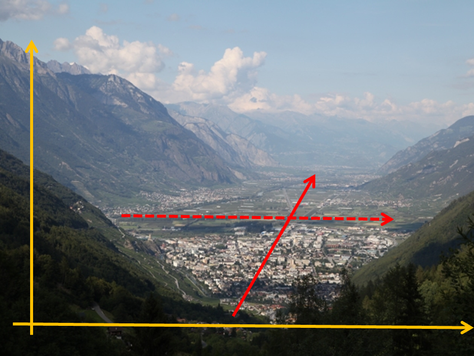

# Rappels sur l'analyse factorielle

- Ce sont des méthodes d’analyse et de simplification d’un grand nombre de données
- Elles permettent de **réorganiser** et **hiérarchiser** l’information
- Il s’agit de **méthodes descriptives** et non explicatives

---

L’analyse factorielle est un terme générique pour une famille d’analyse :

- Les analyses en composante principale (ACP);  
- Les analyses factorielles des correspondances (AFC);  
- Etc.  

---

> « Elle permet d’extraire le maximum d’information sous une forme simple et cohérente à partir d’un ensemble très important de données et sert à mettre en évidence les interrelations entre les variables et les ressemblances et oppositions entre les unités géographiques analysées. »

Sanders L., 1989, *L’analyse statistique des données en géographie*, p.17

---

Les analyses factorielles permettent de traiter des masses importantes de données 
(= nombre élevé de variables), qui nécessitent une **synthèse** des données, par deux opérations :

1. La **réduction** de la masse d’information, par « agrégation » de variables (réduire le nombre de colonnes)
    - Les différentes variables décrivant les éléments vont être « **combinées** » en **composantes** différenciant ces éléments au maximum entre eux
    - Exemple : chez Bourdieu, une composante « capital global » et une composante « composition du capital » résument les caractères utilisés pour décrire les individus et servent à composer des classes sociales 
    
---

2. Une étude des **relations** entre les variables
    - Afin d’éliminer les **redondances** entre variables
    - Notamment lorsqu’elles sont **très corrélées** entre elles
    - Pour éviter la répétition : une **composante synthétique nouvelle** qui remplace les variables d’origine
    - Exemple : lorsque l’on étudie des communes, le revenu moyen des ménages, le revenu médian des ménages et le revenu moyen des hommes/femmes sont très corrélés.

---

A retenir :  

- L’analyse factorielle consiste à **réduire** un nombre important de variables tout en minimisant la perte de l’information
- Réduire la redondance = éliminer la **multicolinéarité**
- Les facteurs issus de l’analyse factorielle peuvent servir de variables **indépendantes** (prédicteurs) dans une analyse de régression.


# L'Analyse en Composantes Principales

---

## Définition

- Est une technique d’**analyse factorielle**
- S’applique à des variables **quantitatives**
- Va permettre de former des facteurs qui sont des **combinaisons linéaires de variables** initiales
- Elle fonctionne donc sur le principe de la **corrélation**.

---

- L’espace géographique n’est **pas pris en compte** dans l’analyse (pas d’auto-corrélation spatiale)
- C’est à l’utilisateur d’interpréter les configurations spatiales a posteriori, en **cartographiant** les résultats de l’analyse.

---

- L’ACP privilégie une **entrée par les variables** dans le but de **réduire leur nombre**,
- et non une entrée par les individus.

---

## Données en entrée

- Les données doivent être **quantitatives** et exprimées :  

    - Dans une même unité, à condition d’être **centrées** 
    - Dans des unités différentes, à condition d’être **standardisées**
    - Plutôt des taux (mesures pas trop éloignées, % ou indices)

---

Si les données sont exprimées dans une même unité  (ex : % ou indice) :  

- La somme en ligne d’une partie des variables ne doit pas être identique pour l’ensemble des lignes.
- ex : si l’on étudie le % de PCS (en 6 modalités) par région, on n’en retient que 5, la 6e est sous-entendue.

--- 

## Méthode

- Géométriquement : On cherche la droite qui correspond à l’**allongement maximal** du nuage de points en *n* dimensions
    - Il prend en compte la plus grande part de **variance** (différence) du nuage
    - Comme pour la régression linéaire : c’est la droite la plus proche de tous les points à la fois

---

> « La direction de l’axe d’allongement maximum du nuage de points est celle du vecteur propre de la matrice des corrélations associée à sa plus grande valeur propre » .

Sanders L., 1989, p28

---

- Dans une **ACP normée** (ACP la plus souvent utilisée), les axes sont **orthogonaux** (pas de redondance)
- Le second axe d’allongement	correspond à la 2e plus grande valeur propre etc.
- Il y a autant d’axe que de variables initiales

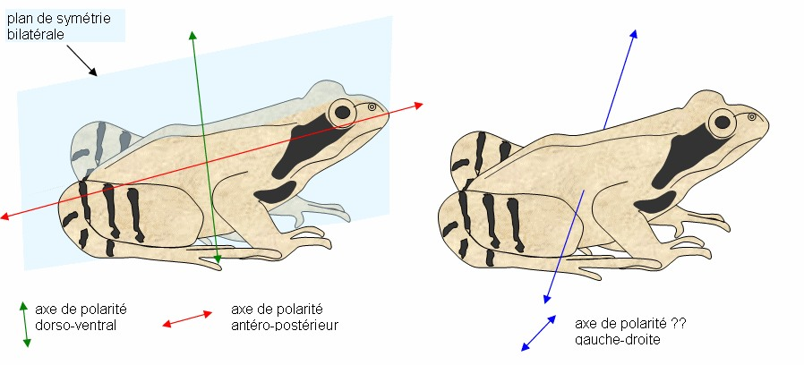

---

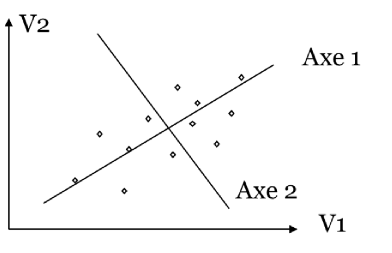

---

- On passe alors de variables standardisées à des facteurs / composantes / axes.
- Les facteurs sont notés F*i* et classés par ordre croissant.
- Le premier facteur F1 résume le plus d’information. Le second un peu moins ... jusqu’à F*n*.
- Chaque facteur est indépendant des autres.
    - => aucune corrélation entre eux
    - => géométriquement, ils sont perpendiculaires 2 à 2
    - => Aucune redondance entre facteurs

---


## Inteprétation


Les résultats d’une ACP sont de 4 types :  

- Relatifs aux **valeurs propres** (valeurs propres brutes, part de variance et part de variance cumulée)
- Les **Coordonnées** sur les axes des **variables** et des **individus**
- Les **Contributions** des variables/individus à la formation des axes
- Les **Qualités de représentation** des variables/individus par les axes  

---

- Les facteurs sont caractérisés par :  

    - Leur valeur propre (eigenvalues)
    Elle correspond à la variance (le taux d'inertie) du nuage de points surcet axe.
    Elle est interprétable comme la variance relative (part dans la variance totale),
    c’est-à-dire la part d'information observable sur cet axe;
    Plus elle est élevée, plus le facteur « porte » d’informations.  
    
    - Leur part de variance et leur pourcentage cumulé  
    La part de variance totale prise en compte par un facteur est en effet définie
    comme le rapport entre la valeur propre qui caractérise le facteur et la somme des valeurs propres;

---

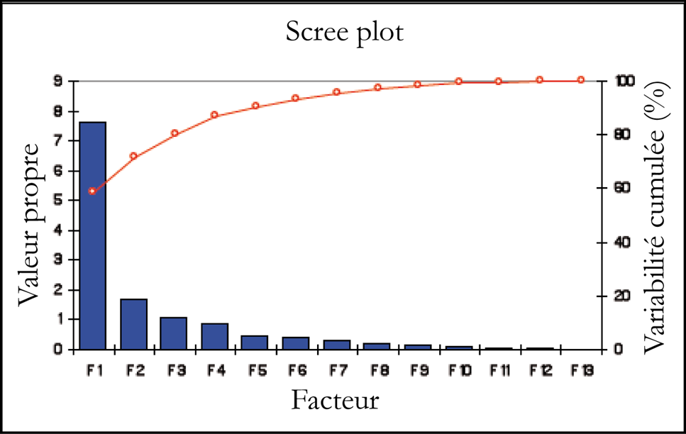

---

- Les coordonnées de variables :  

    - Elles correspondent au coefficient de corrélation des variables avec les facteurs 
    (= le cosinus de l'angle entre la variable et l'axe factoriel)
    - Elles permettent d’identifier la composition de chaque facteur ainsi que les oppositions / associations entre les variables sur le facteur;
    - Attention, des coefficients de corrélations positifs ou négatifs ne correspondent pas à des sous / sur-représentations.

---

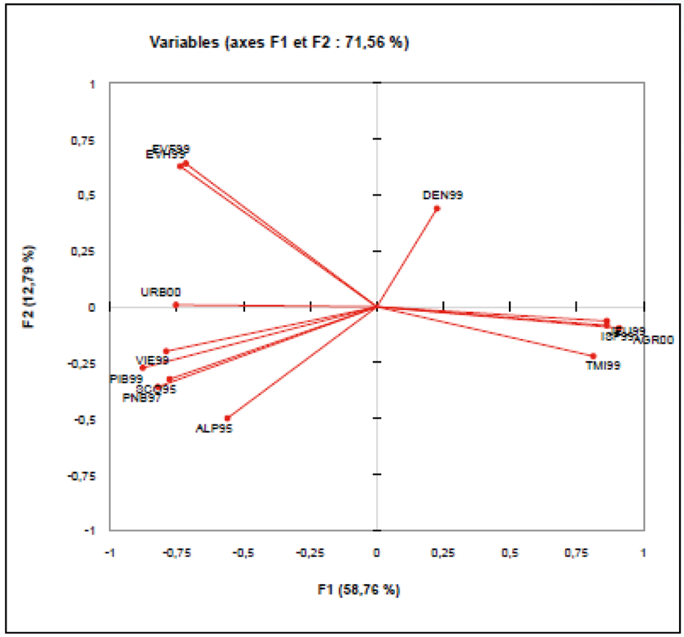

---

- Les coordonnées des individus :

    - Correspondent à la position de chaque individu géographique par rapport à l’axe factoriel étudié.
    - On les obtient en multipliant les données centrées-réduites par les coefficients des vecteurs propres;
    - Attention, les coordonnées des individus ne sont pas des coefficients de corrélation contrairement aux coordonnées des variables.
    Elles peuvent être inférieures à -1 ou supérieures à +1;

---

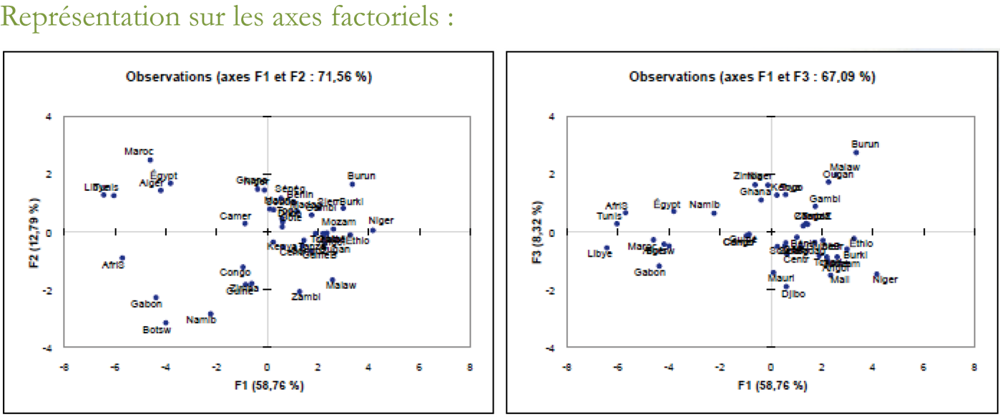

---

- Les contributions (CTR) des variables/individus aux axes factoriels :  

    - Mesurent le **rôle relatif** de chaque variable/individu dans la construction (la caractérisation) de l'axe factoriel;
    - Permettent de repérer quelles sont les **variables les plus contributives** par axe;
    - Permettent d'identifier les variables qui définissent le mieux les axes ;les plus contributives
    - Permettent d'isoler les variables qui ont un comportement exceptionnel (ou aberrant).  
    - La somme des contributions vaut 1 (ou 1000);
    (Pareil pour les individus)
    
---

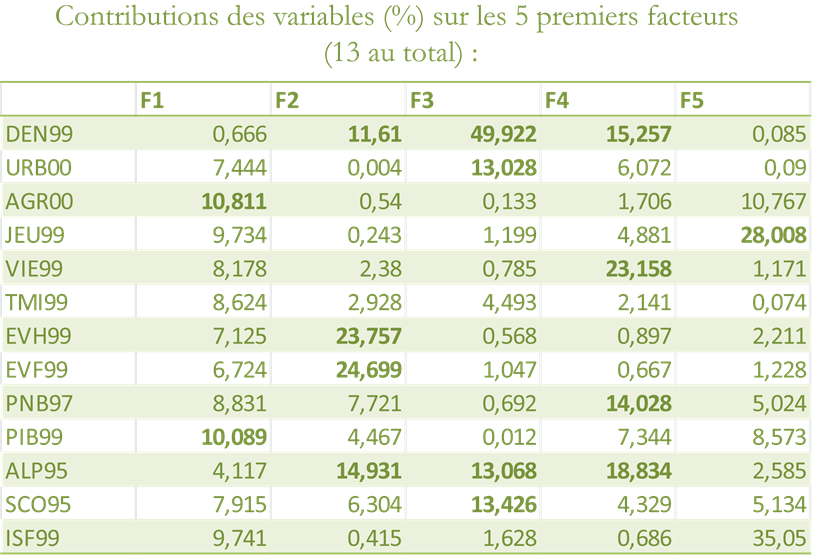

---


- La qualité (QLT ou Cos2) de représentation d'une variable sur un axe factoriel :    

    - est donnée par le carré de sa coordonnée sur cet axe ; 
    - mesure la part de la variable expliquée par l'axe ;
    - Additionner le carré de sa coordonnée pour deux axes,
    c'est obtenir la part de la variable expliquée sur ce plan factoriel.
    - Les cosinus² correspondent simplement aux coordonnées des variables élevées au carré.
    Il s’agit donc des coefficients de détermination entre la variable et l’axe

--- 

- Pour les individus :  

    - permet de caractériser les individus par les axes
    - mesure la part de l'écartement d'un individu
    au centre de gravité prise en compte par un axe

---

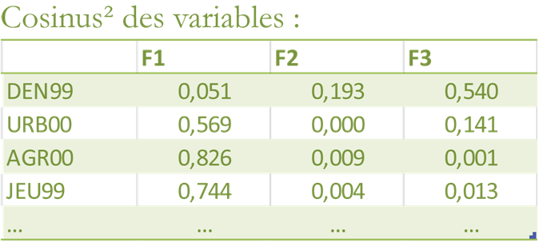


# Calcul et représentation avec R

---

## Import général

```{r chargement des packages}
library(dplyr)
library(ggplot2)
library(scales)
library(tidyr)

library(ade4)
```

---

## Calcul d'une ACP avec `ade4`

```{r calcul ACP}
str(iris)
donneesExemple <- iris %>%
  select(-Species)

acpExemple <- dudi.pca(df = donneesExemple,
                      center = TRUE,
                      scale = TRUE,
                      scannf = FALSE,
                      nf = ncol(donneesExemple))

```

---

## Représentation des valeurs propres avec `ggplot2`

 
```{r eigenvalues}
vPropres <- data_frame(Composante = 1:length(acpExemple$eig),
                       VP = acpExemple$eig,
                       VAR = VP / sum(VP),
                       CUMVAR = cumsum(VAR))
ggplot(vPropres) +
  geom_bar(aes(x = factor(Composante), VAR), stat = "identity", fill = "grey") +
  geom_point(aes(x = Composante,y = CUMVAR)) +
  geom_line(aes(x = Composante,y = CUMVAR)) +
  scale_x_discrete(name ="Composante Principale") +
  scale_y_continuous(name = "Part de la variance totale", labels = percent) +
  theme_bw()
```

---

## Représentation des coordonnées des variables avec `ade4`

```{r coords var ade4}
s.corcircle(acpExemple$co)
```

---

## Représentation des coordonnées des variables avec `ggplot2`

```{r coords var ggplot2}
coordsVar <- as_data_frame(acpExemple$co) %>%
  mutate(VAR = row.names(acpExemple$co))

ggplot(coordsVar, aes(x = Comp1, y = Comp2)) +
  geom_hline(yintercept = 0) +
  geom_vline(xintercept = 0) +
  geom_segment(x = 0, y = 0, aes(xend = Comp1, yend = Comp2)) +
  geom_label(aes(label = VAR), alpha = 0.5) +
  scale_x_continuous(limits = c(-1,1)) +
  scale_y_continuous(limits = c(-1,1)) +
  coord_fixed()
```

---

## Représentation des coordonnées des individus avec `ggplot2`

```{r coords indivs ggplot2}
coordsIndiv <- as_data_frame(acpExemple$li)

ggplot(coordsIndiv, aes(Axis1, Axis2)) +
  geom_point() +
  geom_hline(yintercept = 0) +
  geom_vline(xintercept = 0) +
  coord_fixed()
```

---

Ajout d'une variable descriptive

```{r coords indiv cat}

coordsIndiv$Species <- iris$Species

ggplot(coordsIndiv, aes(Axis1, Axis2, group = Species ,col=Species)) +
  geom_point() +
  stat_ellipse() +
  geom_hline(yintercept = 0) +
  geom_vline(xintercept = 0) +
  coord_fixed()

```


## Calcul et représentation des contributions des variables
```{r contribs var 1}
contribs <- inertia.dudi(acpExemple, row.inertia = TRUE, col.inertia = TRUE)

contribVar <- as_data_frame(contribs$col.abs) %>%
  mutate(Var = row.names(contribs$col.abs))

contribVarLong  <- contribVar %>%
  gather(key = Axis, value = Value, -Var) %>%
  mutate(Value = Value/10000)
```

---

```{r contribs var 2}
ggplot(contribVarLong, aes(Axis, Value, fill = Var)) +
  geom_bar(stat="identity") +
  scale_y_continuous(labels= percent)
```

---

## Représentation des contributions des individus

```{r contribs indivs}

ctrIndiv <- as_data_frame(contribs$row.abs / 10000)
colnames(ctrIndiv) <- paste("CTR", colnames(ctrIndiv), sep="")

coordsIndiv <- coordsIndiv %>%
  cbind(ctrIndiv)

ggplot(coordsIndiv, aes(Axis1, Axis2, size=CTRAxis1)) +
  geom_point() +
  geom_hline(yintercept = 0) +
  geom_vline(xintercept = 0) +
  coord_fixed()
```

---

## Calcul et représentation des qualité des variables

On repart de la variable `contribs` qui contient aussi cette information

```{r qlt var 1}
qltVar <- as_data_frame(contribs$col.rel) %>%
  mutate(Var = row.names(contribs$col.rel)) %>%
  select(-con.tra)

qltVarLong  <- qltVar %>%
  gather(key = Axis, value = Value, -Var) %>%
  mutate(Value = Value/10000)
```

---

```{r qlt var 2}
ggplot(qltVarLong, aes(factor(Axis), Value, fill = Axis)) +
  geom_bar(stat="identity", position="dodge") +
  facet_wrap(~Var) + 
  scale_y_continuous(labels= percent)
```

---

## Représentation de la qualité des individus

```{r qlt indivs 1}
qltIndiv <- as_data_frame(contribs$row.rel / 10000)
colnames(qltIndiv) <- paste("QLT", colnames(qltIndiv), sep="")

coordsIndiv <- coordsIndiv %>%
  cbind(qltIndiv)
```

---

```{r qlt indivs 2}
ggplot(coordsIndiv, aes(Axis1, Axis2, col=QLTAxis1)) +
  geom_point() +
  geom_hline(yintercept = 0) +
  geom_vline(xintercept = 0) +
  scale_colour_gradient2(low="navyblue", mid="white", high="firebrick3") +
  coord_fixed()
```

# Exercice d'application  

--- 

## Énoncé  

- Réalisez une ACP sur le tableau de données `tabSocial`, qui contient des variables sociales structurelles sur votre aire d'étude.
- Vous pourrez en cartographier les coordonnées des individus (les communes) sur les axes.

---

## Exemple de cartographie

```{r}
library(cartography)

times100 <- function(x){x * 100}
tabSocialPct <- tabSocial %>%
  mutate_each(funs(times100), -COMMUNE)

choroLayer(spdf = toulCom, 
          df = tabSocialPct, 
          spdfid = "INSEE_COM",
          dfid = "COMMUNE",
          var = "txRETRAITES",
          method = "quantile",
          nclass =  5)
```


# Sources

---

## Cours  

- C. Cottineau & A. Pavard - Cours d'Analyse de Données et Représentations Cartographiques, L3 (Université Paris 1)
- Sanders L., 1989, *L’analyse statistique des données en géographie*

## R  

- R : Groupe ElementR - R et Espace (Framabook)
