```{r knitr_init, echo=FALSE, cache=FALSE}
library(knitr)
library(rmdformats)

## Global options
options(max.print="75")
opts_chunk$set(echo=TRUE,
	             cache=TRUE,
               prompt=FALSE,
               tidy=TRUE,
               comment=NA,
               message=FALSE,
               warning=FALSE)
opts_knit$set(width=75)
```

```{r creation des variables à utiliser, echo =  FALSE, eval = FALSE}
load(file = "../DATA/RPDetail.RData")

ComputePercentage <- function(df, varquali){
  # calcule les résumés par commune et par modalité
  dfLong <- df %>% 
    group_by_("COMMUNE", varquali) %>%
    summarise(NB = sum(IPONDL))
  
  # transforme en format large
  castFormula <- paste("COMMUNE", " ~ ", varquali, sep = "")
  dfWide <- dcast(dfLong, formula = castFormula, value.var = "NB", drop = FALSE, fill = 0)
  
  # calcule le total ligne
  totalLgmt <- apply(dfWide[, 2:ncol(dfWide)], 1, sum)
  
  # calcule les pourcentages sur le total ligne
  matPct <- apply(dfWide[, 2:ncol(dfWide)], 2, function(x) x / totalLgmt)
  colnames(matPct) <- paste(varquali, sort(unique(df[[varquali]])), sep = "")
  
  # reconstruit le tableau final
  dfFinal <- data.frame(COMMUNE = dfWide$COMMUNE,
                        matPct,
                        stringsAsFactors = FALSE)
  
  return(dfFinal)
}

toulResidPrinc <- toulLog %>% filter(CATL == 1)

# statut d'occupation du logement
tabSTOCD <- ComputePercentage(df = toulResidPrinc, varquali = "STOCD")
# 00 : Logement ordinaire inoccupé
# 10 : Propriétaire
# 21 : Locataire ou sous-locataire d'un logement loué vide non HLM
# 22 : Locataire ou sous-locataire d'un logement loué vide HLM
# 23 : Locataire ou sous-locataire d'un logement loué meublé ou d'une chambre d'hôtel
# 30 : Logé gratuitement
# ZZ : Hors logement ordinaire

# immigration personne de référence
tabIMMIM <- ComputePercentage(df = toulResidPrinc, varquali = "IMMIM")
# 1 : Immigrés
# 2 : Non immigrés
# Y : Hors résidence principale

# activité de la personne de référence
tabTACTM <- ComputePercentage(df = toulResidPrinc, varquali = "TACTM")
# 11 : Actifs ayant un emploi, y compris sous apprentissage ou référence du ménage en stage rémunéré
# 12 : Chômeurs
# 21 : Retraités ou préretraités
# 22 : Elèves, étudiants, stagiaires non rémunérés de 14 ans ou plus
# 23 : Moins de 14 ans
# 24 : Femmes ou hommes au foyer
# 25 : Autres inactifs
# YY : Hors résidence principale
# ZZ : Hors logement ordinaire

# diplome personne de référence
tabDIPLM <- ComputePercentage(df = toulResidPrinc, varquali = "DIPLM")
# 01 : Pas de scolarité
# 02 : Aucun diplôme mais scolarité jusqu'en école primaire ou au collège
# 03 : Aucun diplôme mais scolarité au delà du collège
# 11 : Certificat d'études primaires
# 12 : BEPC, brevet élémentaire, brevet des collèges
# 13 : Certificat d'aptitudes professionnelles, brevet de compagnon
# 14 : Brevet d'études professionnelles
# 15 : Baccalauréat général, brevet supérieur

# type de logement
tabTYPL <- ComputePercentage(df = toulResidPrinc, varquali = "TYPL")
# 1 : Maison
# 2 : Appartement
# 3 : Logement-foyer
# 4 : Chambre d'hôtel
# 5 : Habitation de fortune
# 6 : Pièce indépendante (ayant sa propre entrée)
# Z : Hors logement ordinaire

# Ancienneté de recherche d'emploi (personne de référence du ménage)
tabRECHM <- ComputePercentage(df = toulResidPrinc, varquali = "RECHM")
# 0 : Ne recherche pas d'emploi
# 1 : Cherche un emploi depuis moins d'un an
# 2 : Cherche un emploi depuis plus d'un an
# 9 : Non déclaré (inactif)
# Z : Sans objet (en emploi)
# Y : Hors résidence principale

tabSocial <- tabSTOCD %>%
  select(COMMUNE, STOCD10, STOCD22) %>%
  rename(txPROPRIETAIRES = STOCD10, txHLM = STOCD22) %>%
  left_join(by = "COMMUNE",
    tabIMMIM %>%
      select(COMMUNE,IMMIM1) %>%
      rename( txIMMIGRES = IMMIM1)
  ) %>%
  left_join(by = "COMMUNE",
    tabTACTM %>%
      select(COMMUNE, TACTM12, TACTM21) %>%
      rename(txCHOMEURS = TACTM12, txRETRAITES =  TACTM21)
  ) %>%
  left_join(by = "COMMUNE",
    tabDIPLM %>%
      select(COMMUNE, DIPLM15) %>%
      rename(txDIPLOMESUP = DIPLM15)
  ) %>%
  left_join(by = "COMMUNE",
    tabTYPL %>%
      select(COMMUNE, TYPL1, TYPL2) %>%
      rename(txMAISONS =  TYPL1,txAPPARTEMENTS = TYPL2)
  ) %>%
  left_join(by = "COMMUNE",
    tabRECHM %>%
      select(COMMUNE, RECHM2) %>%
      rename(txCHOMEURSLONGUEDUREE = RECHM2)
  )

save(list = c("toulCom","tabSocial"), file = "ACP.Rdata")
```

```{r chargement donnees exemple, echo = FALSE}
load("Multivarie.Rdata")
```


# Introduction

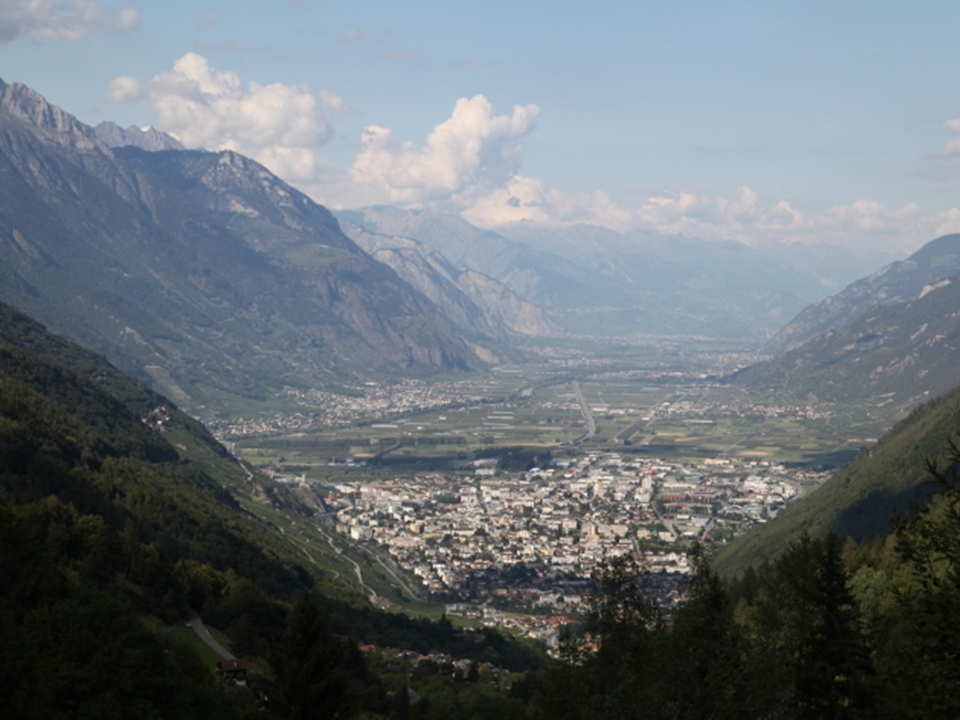

---

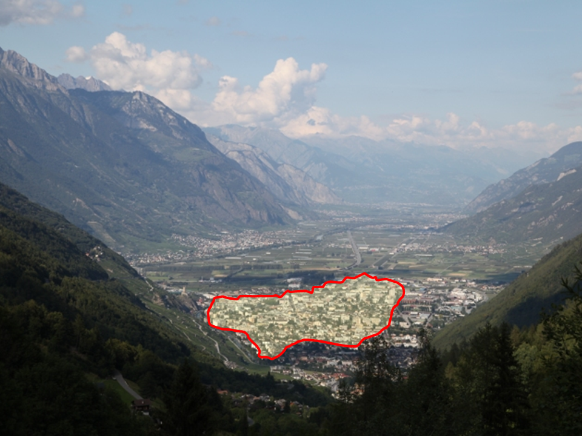

---

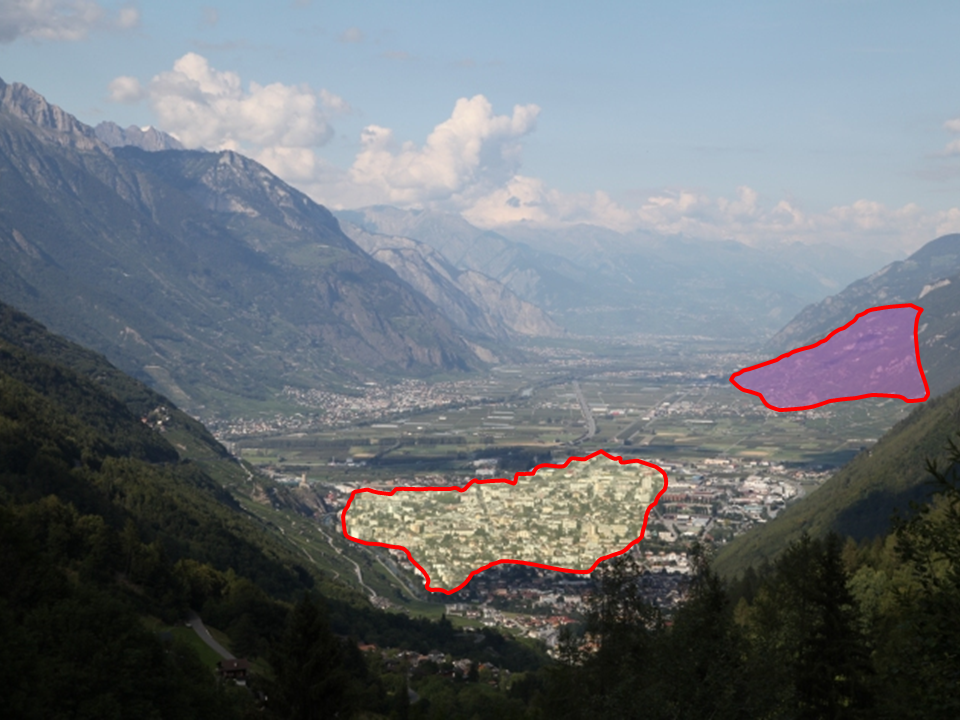

---

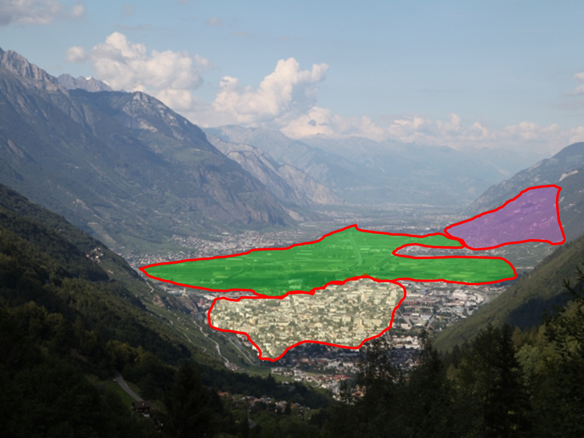

---

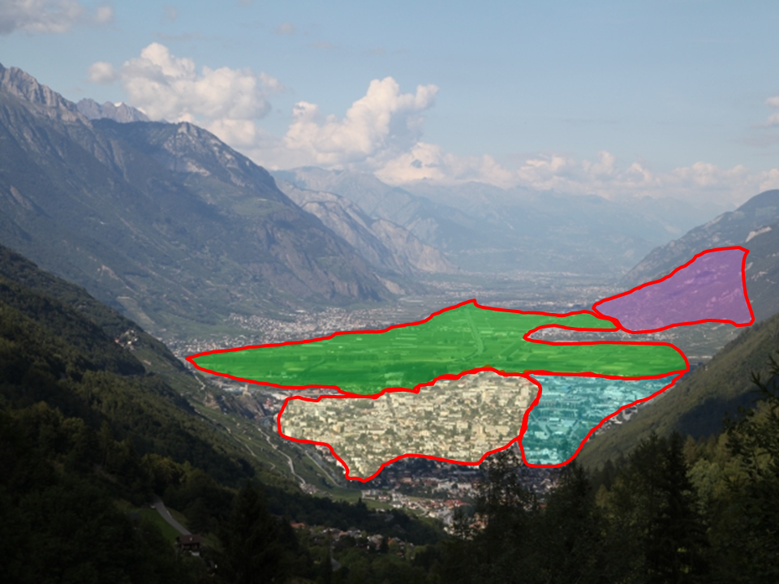

# Rappels sur les méthodes de classification

## Objectifs

- **Organiser** l’information;
- Rassembler dans une même classe les objets qui se **ressemblent**;
- Obtenir des classes d’éléments formant une **partition** de l’ensemble étudié;
- Associer à chaque classe un type **généralisant** les éléments de la classe.

## Lien avec les analyses factorielles

- L’analyse factorielle cherche à **réduire le nombre de variables** (repose sur la similarité des variables).
- L’analyse de classification cherche à **regrouper les observations** similaires (repose sur la similarité des observations).
- Technique de réduction de données : réduire les *n* observations originales en *g* groupes (*1* $\le$ *g*  $\le$ *n*);
- Le but est de minimiser la variation intra-classes et maximiser la variation inter-classes.

---

Complémentarité :  

- L’analyse factorielle met en évidence des structures.
Toutefois, les analyses factorielles conduisent à :  

    1. Des résultats souvent difficiles à interpréter;
    2. Une visualisation à deux ou très peu de dimensions,
    alors que le nombre de facteurs « significatifs » peut être supérieur;
    3. Une visualisation pouvant manquer de robustesse
    (un individu au profil aberrant peut influencer notablement les facteurs);
    4. Une visualisation graphique chargée et peu lisible.

---

- **L’analyse de classification** cherche à **partitionner** l’ensemble des individus statistiques élémentaires à partir de l’ensemble des variables ou des facteurs les plus significatifs d’une analyse factorielle :  

    - Les classes (ou *clusters*) prennent en compte la dimension réelle du nuage de points.
    Elles corrigent des déformations dues à l’opération de projection.
    Elles aident à la compréhension des axes factoriels;
    - Algorithmes d’agglomération plus robustes.
    Les classes sont indépendantes d’éventuels points marginaux isolés (valeurs extrêmes);
    - Les classes sont plus simples à décrire que des espaces continus.
    La sortie graphique est allégée (une carte en classes).

---

> On peut utiliser une méthode de classification sur les facteurs résultant d'une ACP.

## Les méthodes de classification

Deux grands types

### Classification non hiérarchique :  

- Décision a priori de former n groupes = désavantage;
- Choix de points de base et groupement des autres autour d’eux :
- Choix aléatoire, systématique, sur un maillage géographiqu
ou à partir d’exigences propres au problème.
- Ex. : *k-means*, *nuées dynamiques*...  

---


### Classification hiérarchique :  

- Débute avec **n groupes** (*cluster*) ;  *n* = nombre d’éléments ;
- On joint 2 groupes, il reste *n-1* groupes ;
- On continue : *n-2* groupes, *n-3*  etc.
- Jusqu’à ce qu’il n’y ait qu’un seul groupe qui contient l’ensemble des observations;
- Processus **hiérarchique** car la fusion de deux observations
à n’importe quelle étape ne peut pas se défaire plus tard (aux étapes suivantes de regroupement);


# La Classification Ascendante Hiérarchique

## Définition

> C'est une méthode hiérarchique

### Objectif

  - Regrouper les individus qui se ressemblent le plus 
  - Construire un « arbre généalogique » des éléments comportant différents degrés de ressemblance

---

## Données en entrée


- La	CAH	permet	d’organiser des éléments, définis par des **variables quantitatives**,
en les **regroupant** hiérarchiquement.
- Agrégation	des	plus	semblables aux	moins	semblables (l’ensemble de l’effectif)
- C’est parce que cette technique part du particulier pour remonter au général qu’elle est dite « **ascendante** » ou agglomérative.

---


## Méthode

### Démarche

- Au début : il y a autant de groupes de que d’éléments;
- On calcule **les distances entre groupes** en prenant en compte toutes les dimensions;
- On   **rassemble**   les   deux   groupes   (ou   éléments)   les   plus   proches   (=   les   plus ressemblants).
- Lorsqu’un  groupe  est  formé,  ses  éléments  ne  se  sépareront  plus.  => hiérarchique
- On recalcule les nouvelles distances entre groupes, et on rassemble à nouveau les deux groupes les plus proches
- Jusqu’à ce qu’il ne reste qu’un groupe rassemblant tous les éléments

---

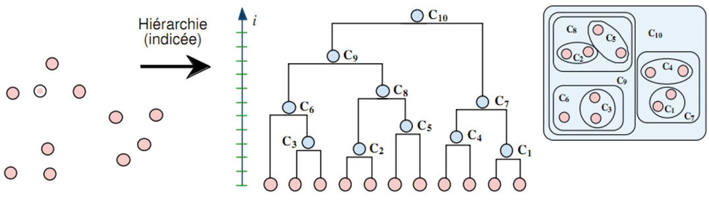
*Bisson, G., 2011*

---

- On doit regrouper dans une même classe les éléments qui se **ressemblent** le plus
- et séparer ceux qui sont **les plus différents**
- On vise donc à « minimiser l'inertie intra-classes et maximiser l'inertie inter-classes »
- C’est le même principe que pour une discrétisation

---

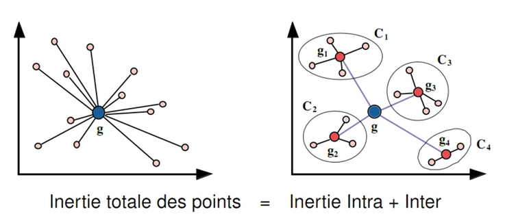
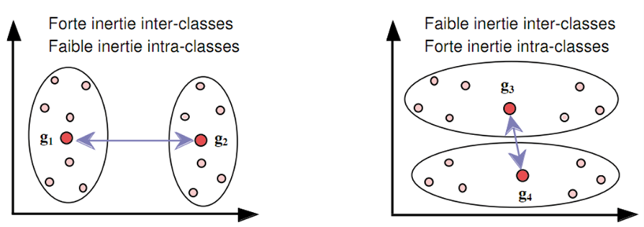

*Bisson, G., 2011*

---

> 1. Comment mesurer la ressemblance (ou la proximité) entre les individus ?
> 2. Comment mesurer des	distances	(dissemblances)	entre classes d’individus ?

---

### Quelle distance entre individus ? Le critère de distance

On utilise des mesures :  

-	De **similarité** : Plus la	mesure est grande, plus les	points sont similaires;
-	De **dissimilarité**	:	Plus	la	mesure	est	petite,	plus	les	points	sont similaires;

---

En géographie, plutôt des mesures de dissimilarité. Ex : 

- **Distance euclidienne** : Utilisée dans le cas d’un tableau de mesures.
    Correspond	à	la	métrique	employée	lors	d’une	analyse	en composantes principales;
- **Distance du X²** : Utilisée pour analyser les tableaux de contingence,
    et plus généralement tous les tableaux auxquels s’appliquent l’AFC.
    Permet de réduire les effets de masse.

---

### Quelle distance entre groupes ? Le critère d'agrégation

5 méthodes principales :  

-	**Saut minimum** (ou plus proche voisin / `single linkage`) : La distance entre deux classes est définie par la plus courte distance séparant un individu d’une classe et un individu d’une autre classe
    - les classes peuvent être très allongées;
-	**Diamètre** (`complete linkage`): La distance entre deux classes est définie par la plus grande distance séparant un individu d’une classe et un individu d’une autre classe
    - les classes sont plus compactes que celles produites par la précédente méthode
    
---

-	**Distance moyenne** (`average`) dans les classes : La distance entre deux classes est définie en calculant la distance moyenne entre tous les éléments de chaque classe
    - une des méthodes les plus efficaces;
-	**Barycentre** (centre de gravité / `centroid`) : La distance entre deux classes est définie comme étant la distance séparant les centres de gravité des deux classes
    - méthode présentant une bonne résistance aux valeurs extrêmes (bruit).
-	**Méthode de Ward** (`ward.D2`) : Elle consiste à réunir les deux classes dont le regroupement fera le moins baisser l’inertie inter-classe. Cette technique tend à regrouper ensemble les petites classes
    - **C'est la méthode la plus utilisée**

---

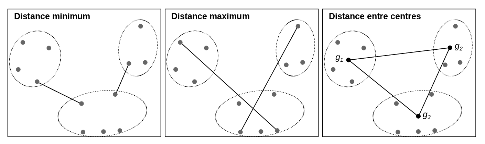
ElementR, p. 124

## Inteprétation

---

### Le diagramme de niveaux

- Le diagramme de niveaux permet de repérer les différents niveaux de regroupement.
- Le niveau de chaque nœud indique l'homogénéité des données agrégées;
- Ce diagramme sert en plus du dendrogramme à établir les zones de coupures, et donc le nombre de classes.

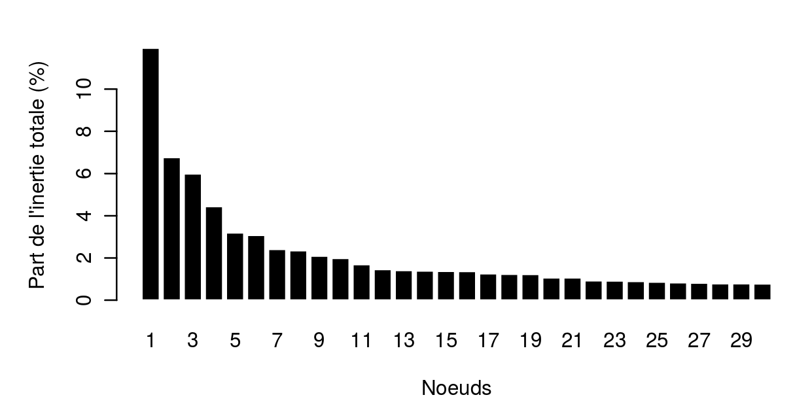
ElementR, p. 128

---

### Le dendrogramme

- Le dendrogramme, ou arbre hiérarchique, montre à la foi les liaisons entre les classes et leur niveau de proximité (grâce à la hauteur des branches)
- Il permet de comprendre les regroupements de classes et d'invididus engendrés par une partition choisie.

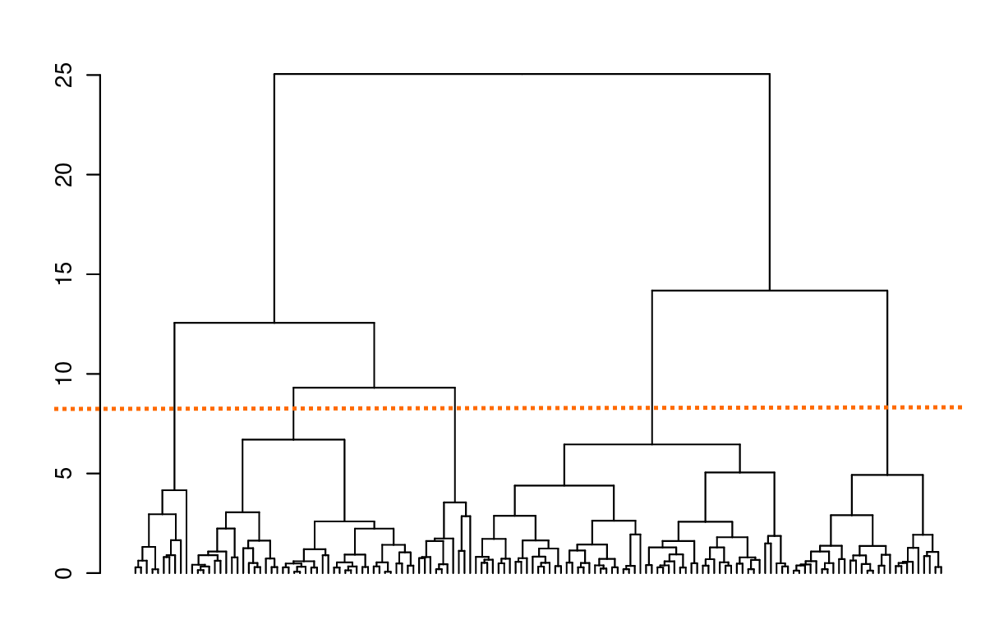
ElementR, p. 130
(Si l'on choisit de conserver 5 classes, la partition se fera sur la ligne orange)

---

### Les profils de classe

- Des statistiques descriptives par classes (nombre d’objets, sommes des poids, distance moyenne au barycentre, distance standardisée etc...);

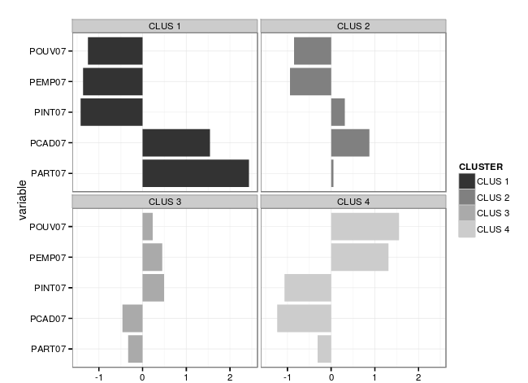
ElementR, p. 132

---

### Les individus

- L'appartenance de chaque individu à une classe peut être visualisée à l'aide d'une carte

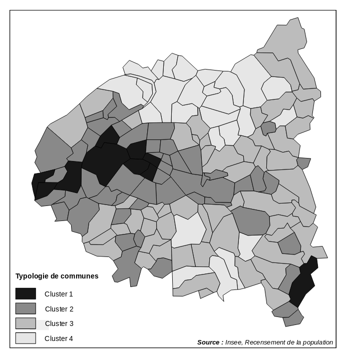
ElementR, p. 133

---

# Calcul et représentation avec R

---

## Import général

```{r chargement des packages}
library(dplyr)
library(ggplot2)
library(scales)
library(tidyr)

library(cluster)
library(ade4) # Calcul de distances aux Khi2
library(FactoClass) # CAH Khi2
```

---

## Calcul d'une CAH avec `cluster::agnes`

```{r calcul agnes}
donneesExemple <- iris %>% select(-Species)

cahAgnes <- agnes(x = donneesExemple,
                  metric = "euclidean",
                  method = "ward")
```

---

## Représentation du diagramme de niveaux

```{r levelplot1}
niveaux <- sort(cahAgnes$height, decreasing = TRUE)
niveauxRelatifs <- niveaux / sum(niveaux)
niveauxCumules <- cumsum(niveauxRelatifs)

dfNiveaux <- data_frame(Poids = niveaux,
                        Inertie = niveauxRelatifs,
                        CumInertie =  niveauxCumules,
                        Partition = 1:length(niveaux))
```


```{r levelplot2}
ggplot(dfNiveaux %>% filter(Inertie > 0.01)) +
  geom_bar(aes(Partition, Inertie),
           stat = "identity",position = "dodge") +
  scale_y_continuous(name = "Part de \nl'inertie totale",
                     labels = percent)
```

---

```{r levelplot3}
ggplot(dfNiveaux %>% filter(Inertie > 0.01)) +
  geom_bar(aes(Partition, CumInertie) ,
           stat = "identity",position = "dodge") +
  scale_y_continuous(name = "Part cumulée de\n l'inertie totale",
                     labels = percent)
```


## Représentation du dendrogramme avec `dendrogram`

```{r dendro1}
dendroBase <- as.dendrogram(cahAgnes)
plot(dendroBase, leaflab = "none")
```


## Partition des classes et représentation du dendrogramme

L'analyse des derniers graphiques permet de constater qu'une partition en 3 classes semblerait adaptée ici.

```{r dendro2}
# Découpe
classesAgnes <- cutree(cahAgnes, k = 3)
# Chargement de fonctions de représentations plus avancées
source("A2Rplots.R")

ordreClasses <- unique(classesAgnes[cahAgnes$order])
cPal <- c(1:3)[ordreClasses]
A2Rplot(x = as.hclust(cahAgnes),
        k = 3,
        boxes = FALSE,
        col.up = "gray50",
        col.down = cPal,
        show.labels = FALSE,
        main = "Dendrogramme")
```

## Profils de classe

```{r profils classe 1}
# On joint l'information des classes aux données initiales
donneesExemple$Classe <- classesAgnes

# Calcul des indicateurs moyens par classe
indicateursClasses <- donneesExemple %>%
  group_by(Classe) %>%
  summarise_each(funs = "mean")

str(indicateursClasses)
# Conversion au format long pour ggplot

indicateursClassesLong <- indicateursClasses %>%
  gather(key = Variable, value = Valeur, -Classe) %>%
  mutate(Classe = factor(Classe))
```

---

```{r profils classe 2}
ggplot(indicateursClassesLong) +
  geom_bar(aes(Variable, Valeur, fill = Classe),
           stat = "identity", position = "dodge") +
  facet_wrap(~ Classe) +
  coord_flip() +
  theme_minimal()
```

## Profils de classes centrés

```{r profils classe moyenne 1}
indicateursClassesCentres <- donneesExemple %>%
  mutate_each(funs(scale(., center = TRUE,scale = FALSE)), -Classe) %>% # Standardisation des résultats
  group_by(Classe) %>%
  summarise_each(funs = "mean") %>%
  gather(key = Variable, value = Valeur, -Classe) %>%
  mutate(Classe =  factor(Classe))
```

```{r profils classe moyenne 2}
ggplot(indicateursClassesCentres) +
  geom_bar(aes(Variable, Valeur, fill = Classe),
           stat = "identity", position = "dodge") +
  facet_wrap(~ Classe) +
  coord_flip() +
  theme_minimal()
```

## Profils de classe standardisés

```{r profils classe std 1}
indicateursClassesStd <- donneesExemple %>%
  mutate_each(funs("scale"), -Classe) %>% # Standardisation des résultats
  group_by(Classe) %>%
  summarise_each(funs = "mean") %>%
  gather(key = Variable, value = Valeur, -Classe) %>%
  mutate(Classe =  factor(Classe))
```


```{r profils classe std 2}
ggplot(indicateursClassesStd) +
  geom_bar(aes(Variable, Valeur, fill = Classe),
           stat = "identity", position = "dodge") +
  facet_wrap(~ Classe) +
  coord_flip() +
  theme_minimal()
```

## CAH avec distance du Khi2

On utilise le *package* `ade4` pour calculer cette distance, qu'on obtient en réalisant une AFC sur les variables

```{r cah khi2 1}
library(ade4)
AFC <- dudi.coa(df=donneesExemple, scannf=FALSE, nf=ncol(donneesExemple))
distMat <- dist.dudi(AFC, amongrow=TRUE)
```

---

Avec cette matrice de distance, on peut alors réaliser une CAH. On utilisera le *package* `FactoClass` car il permet la ré-injection des poids des individus perdus suite au passage au Khi2

```{r cah khi2 2}
library(FactoClass)
CAH <- ward.cluster(distMat, peso = apply(X=donneesExemple, MARGIN=1, FUN=sum) , plots = TRUE, h.clust = 1)
```

---

Graphiques descriptif

```{r cah khi2 3}
niveaux <- sort(CAH$height, decreasing = TRUE)
niveauxRelatifs <- niveaux / sum(niveaux)
niveauxCumules <- cumsum(niveauxRelatifs)

dfNiveaux <- data_frame(Poids = niveaux,
                        Inertie = niveauxRelatifs,
                        CumInertie =  niveauxCumules,
                        Partition = 1:length(niveaux))


```

---

```{r cah khi2 4}
par(mfrow=c(1,3))
plot(as.dendrogram(CAH), leaflab = "none")

ggplot(dfNiveaux %>% filter(Inertie > 0.01)) +
  geom_bar(aes(Partition, Inertie),
           stat = "identity",position = "dodge") +
  scale_y_continuous(name = "Part de \nl'inertie totale",
                     labels = percent)

ggplot(dfNiveaux %>% filter(Inertie > 0.01)) +
  geom_bar(aes(Partition, CumInertie) ,
           stat = "identity",position = "dodge") +
  scale_y_continuous(name = "Part cumulée de\n l'inertie totale",
                     labels = percent)
```

---

Découpe en 3 classes
```{r cah khi2 5}
donneesExemple$Classe <- cutree(tree = CAH, k = 3)

par(mfrow = c(1,2))
plot.dudi(AFC, Tcol = TRUE, Trow = FALSE)
s.class(cstar=1,addaxes=TRUE, grid=FALSE, axesell=TRUE,
        dfxy=AFC$li, fac=as.factor(donneesExemple$Classe), col=1:3,
        label=c(1:3), csub=1.2, possub="bottomright", add=TRUE)


```

---


```{r cah khi2 6}
ordreClasses <- unique(donneesExemple$Classe[CAH$order])
CAH$height <- sqrt(CAH$height)
A2Rplot(x = CAH, k = 3, boxes = FALSE,  col.up = "gray50", col.down = c(1:3)[ordreClasses], show.labels = FALSE, main = "Dendrogramme")
```

# Exercice d'application  

--- 

## Énoncé  

- Réalisez une CAH sur le tableau de données `tabSocial`, qui contient des variables sociales structurelles sur votre aire d'étude.
- Vous pourrez en cartographier les classes des individus

---

## Exemple de cartographie

```{r}
library(cartography)

tabSocial$txPROPRIETAIRES_rec <- cut(tabSocial$txPROPRIETAIRES,
                                     include.lowest=FALSE,
                                     right=TRUE,
                                     breaks=c(0.33544721102942, 0.676843073439932, 0.806862170087977, 1),
                                     labels=c("Peu de propriétaires",
                                              "Classe mixte",
                                              "Beaucoup de propriétaires"))

typoLayer(spdf = toulCom, 
          df = tabSocial, 
          spdfid = "INSEE_COM",
          dfid = "COMMUNE",
          var = "txPROPRIETAIRES_rec")
```


# Sources

## Cours  

- C. Cottineau & A. Pavard - Cours d'Analyse de Données et Représentations Cartographiques, L3 (Université Paris 1)
- G. Bisson - Evaluation & Catégorisation, 2011 (Laboratoire LEIBNIZ) - `http://www.youscribe.com/catalogue/rapports-et-theses/savoirs/techniques/evaluation-categorisation-217204`

## R  

- R : Groupe ElementR - R et Espace, 2014 (Framabook)
